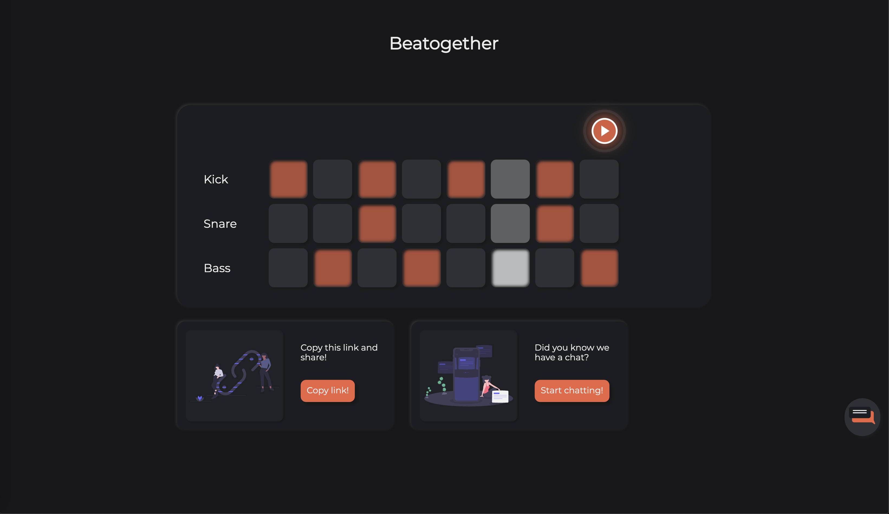
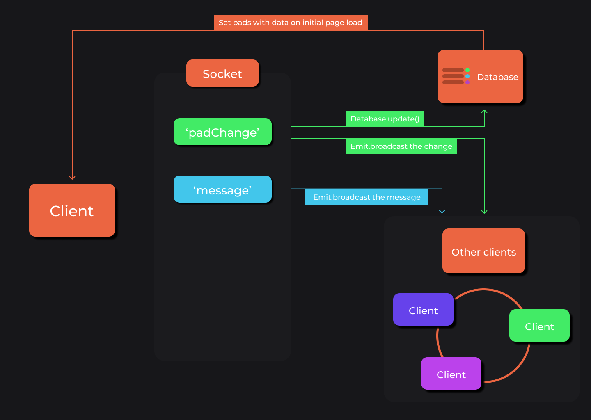
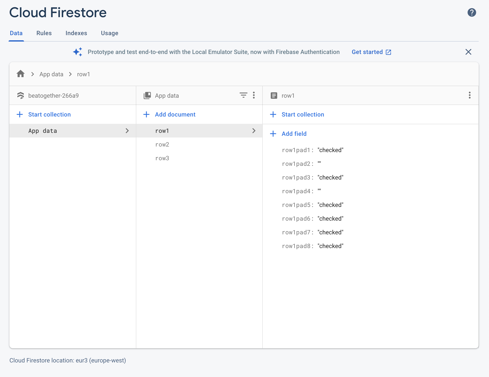

# Beatogether
Beatogether is a step sequencer app that allows people to create beats together using real time web technology.

[Link to the live webapp!](https://beatogether.herokuapp.com/)

 

 

# What is a step sequencer?
A stepsequencer is a device that devides music measures into a specific amount of notes (usually 8 or 16). Users can enable specific notes (pads) to make a sound, the step sequencer will then play the sounds on loop going from left to right continuously. The image below will do a way better job at explaining how it works: 

(screenshot taken from the game It takes two)

 

# Packages
npm packages used in this project

- Express [Link](https://expressjs.com/)
- EJS [link](https://ejs.co/)
- dotenv, to protext some information [link](https://www.npmjs.com/package/dotenv)
- Nodemon [link](https://www.npmjs.com/package/nodemon)
- Socket io [link](https://www.npmjs.com/package/socket.io)
- Firebase [link](https://firebase.google.com/docs/web/setup)

 

# Design sketch
The initial design is pretty simple. I want to add at least 3 different sounds/instruments and a chat if possible. I think a playback indicator is usefull to show how the app works better.

 

# Feature list
## Must haves:
- [x] A constant loop playing the clicked pads
- [x] Multiple sounds to play at the same time
- [x] Real time functionality
- [x] Playback indicator

## Should haves:
- [x] A chat

## Could haves:
- [ ] Save beats
- [ ] Seperate rooms instead of one big session with everyone
- [ ] Pick between different sounds

## Want to have, but not this time:
- [ ] Options to alter sounds (filters effects etc.)
- [ ] Change the tempo or the amount of notes/type of notes

 

# Data life cycle

 

# Socket events

## 'Padchange'
The padchange socket event will start once a user enables or disables one of the pads. The event sends 3 data values trough the socket:
- padId
- padValue

padId holds information about wich pad was clicked, so we know which pad to alter in the database and on other clients.

padValue holds information about the state of the pad. Because the pads are actually checkboxes this value is either 'checked' or '' (empty).

The data from these values is used to update the database and a broadcast.emit is used to update all other clients with the change.

 

## 'Message'
The message socket event will start once a user sends a message in the chat. The event sends 3 data values trough the socket:
- username
- message
- usercolor

username holds the users chosen username, so every user will be able to see the right username with the right message.

message holds the actual message.

usercolor holds the color assigned to a specific user. On page load a randomizer will choose a color out of 6 available colors. By sending this color trough the socket all users will be able to see other users (and themselves) with the right colors.

 

# Database
For this webapp i used firebase to store data. Firebase is easy to use and has a great browser GUI which makes setup a lot easier.

 

The data is divided in three different documents for all three rows of pads in the application, row 1, row 2 and row 3. In these documents there is an id that is the same as the actual id in the HTML element of the pad, and the value which is either "checked" or "" (empty).

Every click by a user on one of the pads will trigger an update to the database for that specific pad.

When a user connects to the webapp for the first time, the data form firebase is used to activate and deactivate the right pads. After this initial setup new changes will be handled by the socket.