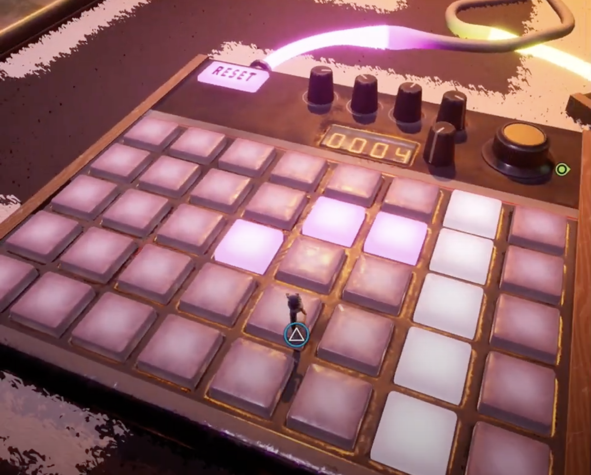
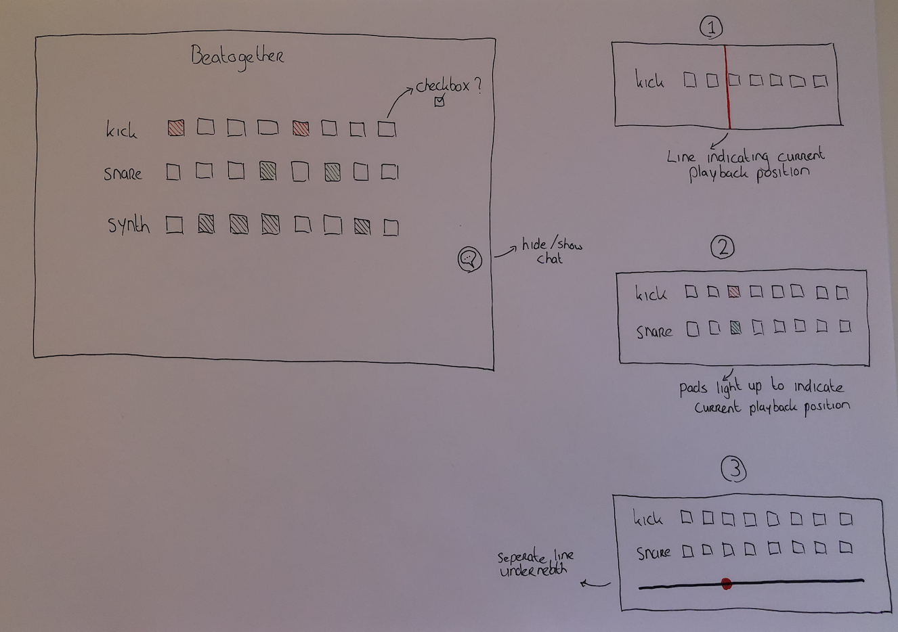
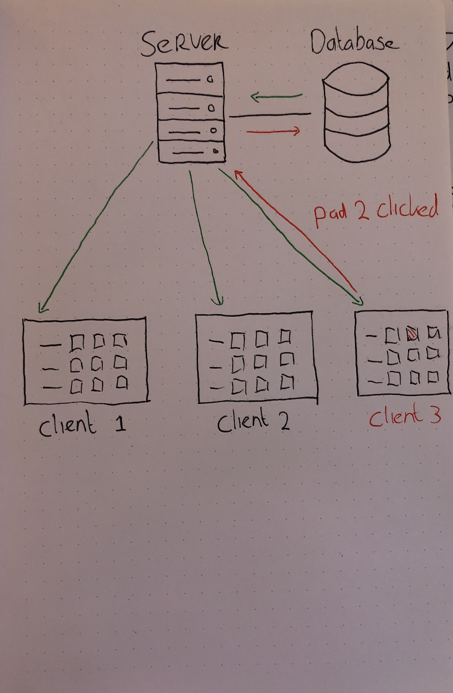

# Beatogether
Beatogether is a step sequencer app that allows people to create beats together using real time web technology.

 

# What is a step sequencer?
A stepsequencer is a device that devides music measures into a specific amount of notes (usually 8 or 16). Users can enable specific notes (pads) to make a sound, the step sequencer will then play the sounds on loop going from left to right continuously. The image below will do a way better job at explaining how it works: 

(screenshot taken from the game It takes two)

 

# Packages
npm packages used in this project

- Express [Link](https://expressjs.com/)
- EJS [link](https://ejs.co/)
- dotenv, to protect my database information on github [link](https://www.npmjs.com/package/dotenv)
- Nodemon [link](https://www.npmjs.com/package/nodemon)
- Socket.io [link](https://www.npmjs.com/package/socket.io)

 

# Design sketches
The initial design is pretty simple. I want to add at least 3 different sounds/instruments and a chat if possible. I think a playback indicator is usefull to show how the app works better.

 

My first quick sketch of the Data lifecycle diagram.

 

# Feature list
## Must haves:
- A constant loop playing the clicked pads
- Multiple sounds to use
- Real time functionality

## Should haves:
- Playback indicator
- A chat

## Could haves:
- Save beats
- Seperate rooms instead of one big session with everyone
- Pick between different sounds

## Want to have, but not this time:
- Options to alter sounds (filters effects etc.)
- Change the tempo or the amount of notes/type of notes

